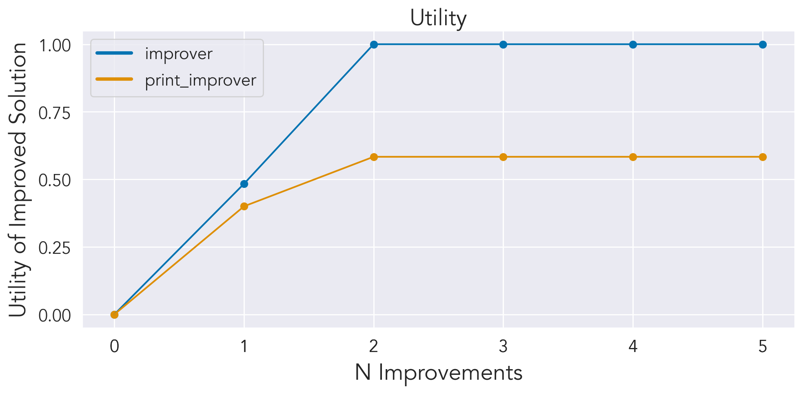

Does printing help a model repair a solution to the pairty learning task? 

Running a simulation:

1. export azure openai key `export OPENAI_API_KEY=<yourkey>`
2. navigate to experiments folder `cd experiments/proof_of_concept`
3. run `python main.py`

Example Runs:

